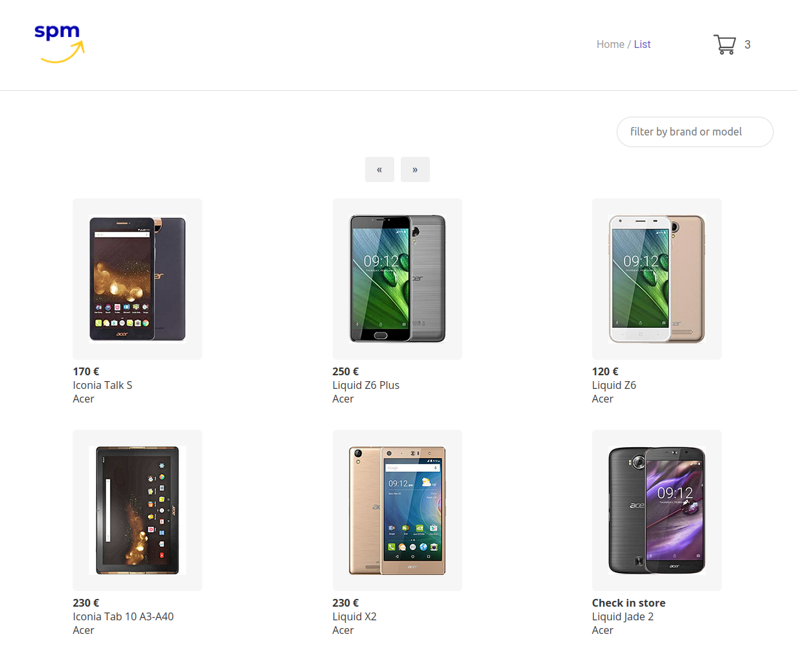
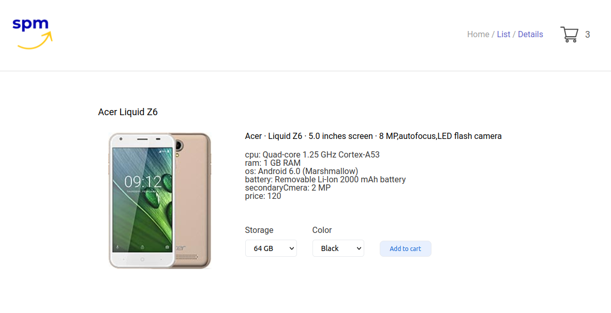
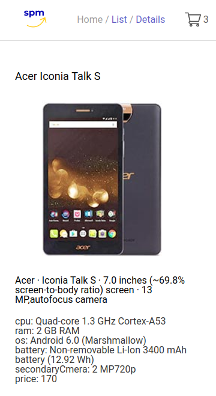

# Smartphone Marketplace

This React web application simulates a smartphone marketplace. Users can browse devices, check their details and add them to a simulated shopping cart.

## Project Screen Shots

 

 

 

 
 

## Installation and Setup Instructions

Clone down this repository. You will need `node` and `npm` installed globally on your machine.

Installation:

`npm install`

To Run Test Suite:

`npm test`

To Start Server:

`npm start`

To Visit App:

`localhost:3000`
